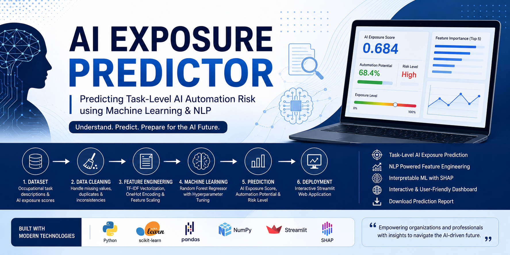
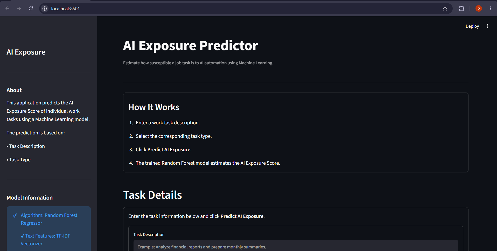
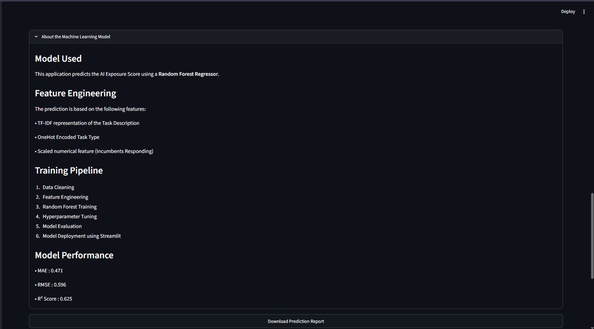
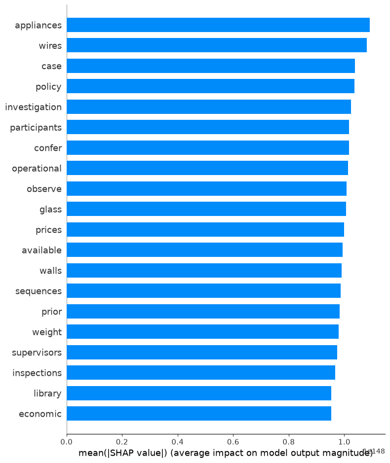

<p align="center">
  
</p>

<h1 align="center">AI Exposure Predictor</h1>

<p align="center">
Predicting Task-Level AI Automation Risk using Machine Learning & NLP
</p>


<div align="center">

# AI Exposure Predictor

### Predicting Task-Level AI Automation Risk using Machine Learning & NLP

[](https://www.python.org/)
[](https://scikit-learn.org/)
[](https://streamlit.io/)
[]()

An end-to-end Machine Learning application that predicts **how susceptible an individual job task is to AI automation** using Natural Language Processing (TF-IDF) and Random Forest Regression.

</div>

---

# Table of Contents

- Overview
- Problem Statement
- Solution
- Features
- Machine Learning Pipeline
- Tech Stack
- Project Structure
- Model Performance
- Application Screenshots
- Installation
- Future Scope
- Author

---

# Overview

Artificial Intelligence is transforming industries by automating repetitive and data-intensive tasks. However, most existing automation studies estimate AI impact at the **occupation level**, often stating that an entire profession is likely to be automated.

This approach is often misleading because **jobs consist of multiple tasks**, each with varying levels of automation potential.

For example:

A **Lawyer** performs tasks such as:

- Researching previous legal cases
- Drafting legal documents
- Client consultation
- Passing legal judgments

AI can assist with legal research and documentation, but passing legal judgments still requires human reasoning, ethics, and accountability.

This project predicts **AI Exposure at the task level**, providing a more granular and practical assessment.

---

# Problem Statement

Organizations and professionals need a reliable way to estimate which workplace tasks are likely to be augmented or automated by AI.

Current approaches often:

- classify entire occupations,
- ignore task-level differences,
- provide limited actionable insights.

This project addresses that gap by building a Machine Learning model capable of predicting the AI Exposure Score for individual work tasks using textual descriptions and structured task information.

---

# Solution

This application accepts:

- Task Description
- Task Type

and predicts:

- AI Exposure Score
- Automation Potential
- Risk Level
- Interpretation
- Recommendations

The complete pipeline includes:

- Data Cleaning
- Exploratory Data Analysis
- Feature Engineering
- Model Training
- Hyperparameter Optimization
- Explainable AI
- Streamlit Deployment

---

# Features

- Task-level AI Exposure Prediction
- Natural Language Processing using TF-IDF
- Random Forest Regression
- Hyperparameter Optimization
- Explainable AI using SHAP
- Interactive Streamlit Web Application
- Download Prediction Report
- User-friendly Dashboard

---

# Machine Learning Pipeline

```
Raw Dataset
      │
      ▼
Data Cleaning
      │
      ▼
Exploratory Data Analysis
      │
      ▼
Feature Engineering
      │
      ├──────── TF-IDF Vectorization
      │
      ├──────── OneHot Encoding
      │
      └──────── Feature Scaling
      │
      ▼
Random Forest Regression
      │
      ▼
Hyperparameter Tuning
      │
      ▼
Model Evaluation
      │
      ▼
SHAP Explainability
      │
      ▼
Streamlit Deployment
```

---

# Tech Stack

| Category | Technology |
|-----------|------------|
| Programming | Python |
| Data Analysis | Pandas, NumPy |
| Visualization | Matplotlib |
| NLP | TF-IDF Vectorizer |
| Machine Learning | Scikit-Learn |
| Model | Random Forest Regressor |
| Explainability | SHAP |
| Deployment | Streamlit |

---

# Project Structure

```
AI-Exposure-Predictor
│
├── app
│   ├── app.py
│   ├── predictor.py
│   └── utils.py
│
├── data
│   ├── raw
│   └── processed
│
├── models
│
├── notebooks
│   ├── Week1_Data_Merging.ipynb
│   ├── Week2_Data_Cleaning.ipynb
│   ├── Week3_Feature_Engineering.ipynb
│   ├── Week4_Model_Building.ipynb
│   └── Week5_Model_Optimization.ipynb
│
├── requirements.txt
├── README.md
└── LICENSE
```

---

# Model Performance

| Metric | Value |
|----------|---------|
| Mean Absolute Error | **0.471** |
| Root Mean Squared Error | **0.596** |
| R² Score | **0.625** |

The model successfully captures relationships between textual task descriptions and AI Exposure Scores, providing meaningful predictions for previously unseen tasks.

---

# Application Screenshots

## Home Screen



---

## Prediction Result


---

## Model Information



---

## SHAP Feature Importance



---

## Correlation Heatmap


---

# Installation

Clone the repository

```bash
git clone https://github.com/YourUsername/AI-Exposure-Predictor.git
```

Move into the project

```bash
cd AI-Exposure-Predictor
```

Install dependencies

```bash
pip install -r requirements.txt
```

Run the application

```bash
streamlit run app/app.py
```

---

# Future Improvements

Potential enhancements include:

- Semantic text embeddings using Sentence Transformers
- Gradient Boosting models (XGBoost / CatBoost)
- Cloud deployment
- User authentication
- Prediction history dashboard
- API integration
- Model retraining pipeline

---

# Learning Outcomes

This project demonstrates practical knowledge of:

- Data Cleaning
- Exploratory Data Analysis
- Feature Engineering
- Natural Language Processing
- Machine Learning
- Hyperparameter Optimization
- Explainable AI
- Model Deployment using Streamlit

---

# Author

**Divya Nehete**


GitHub: https://github.com/Divya02-coder

LinkedIn: https://linkedin.com/in/divya-p-nehete-9a07a3254/

---

# License

This project is released under the MIT License.